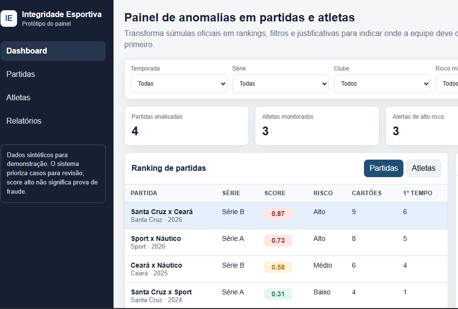

# Painel de Integridade Esportiva

Protótipo interativo para apoiar a triagem de possíveis anomalias em partidas e atletas. A interface transforma registros demonstrativos em rankings, filtros e justificativas, ajudando uma equipe de análise a decidir quais casos devem ser revisados primeiro.

> Este é um projeto educacional com dados sintéticos. Os scores não representam acusações, provas de fraude nem avaliações de pessoas reais.

## Demonstração

[Acesse o painel publicado](https://rebekalemooss-24.github.io/prototipo-painel-integridade/)

## Funcionalidades

- indicadores resumidos de partidas, atletas e alertas;
- filtros por temporada, série, clube, risco e texto;
- alternância entre rankings de partidas e atletas;
- detalhamento dos fatores que compõem cada alerta;
- histórico resumido de eventos;
- exportação dos dados filtrados em CSV;
- layout responsivo para computadores, tablets e celulares.

## Tecnologias

- HTML5;
- CSS3;
- JavaScript sem dependências externas.

## Como executar

1. Baixe ou clone este repositório.
2. Abra o arquivo `index.html` em um navegador moderno.
3. Use os filtros e selecione uma linha para consultar o detalhamento.
4. Clique em `Exportar relatório` para baixar a visão atual em CSV.

Não é necessário instalar dependências ou iniciar um servidor.

## Decisões do protótipo

- **Dados locais:** facilitam a demonstração sem expor informações pessoais ou dados operacionais.
- **Score explicável:** cada alerta apresenta fatores e intensidades, evitando uma classificação sem justificativa.
- **Linguagem cautelosa:** o painel apoia a priorização de revisões e não determina fraude.
- **Interface responsiva:** a navegação e os painéis se adaptam a telas menores.

## Limitações

- os dados utilizados são sintéticos e permanecem no próprio arquivo HTML;
- não há backend, autenticação ou banco de dados;
- os scores são demonstrativos e não foram treinados ou validados como modelo de inteligência artificial;
- as opções de navegação lateral representam áreas planejadas para versões futuras.

## Próximas etapas

- separar estilos, dados e comportamento em arquivos próprios;
- criar uma API para fornecer partidas, atletas e eventos;
- armazenar dados em banco relacional;
- documentar a fórmula de cálculo do score;
- adicionar testes automatizados e validações de acessibilidade;
- evoluir a demonstração pública com dados fornecidos por uma API.

## Autoria

Projeto desenvolvido por Rebeka Lemos como estudo de produto digital, análise de dados e experiência do usuário.
